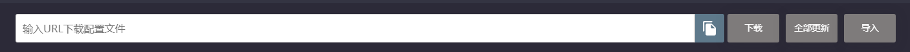

# ssr电脑使用教程\(clash\)

**本文部分资源来源于**[**https://merlinblog.xyz/wiki/cfw.htm**](https://merlinblog.xyz/wiki/cfw.html)**（需要翻墙）  
首先，点击下面这个链接去下载Clash**  
[**https://github.com/Fndroid/clash\_for\_windows\_pkg/releases/**](https://github.com/Fndroid/clash_for_windows_pkg/releases/)  
**然后点击这个来下载（这里使用了油猴脚本，所以有加速下载通道，具体方法请上网自行搜索）**

**打开之后，按照提示安装即可（此处省去安装步骤）  
安装完后开始进行汉化  
首先到这里下载汉化文件:**[**https://sabrinathings.lanzous.com/b01hweblc**](https://sabrinathings.lanzous.com/b01hweblc)  
**下载里面的第一个文件（注意:版本要对应）**

**解压后按照里面的提示进行汉化即可**  

**之后我们进入到添加订阅界面，我们先去机场复制订阅链接，如下图**

**登录**[**https://focloud.ltd**](https://focloud.ltd/)**，转换一下配置  
（偶尔服务器抽风时请登录**[**https://dyzh.ljfxz.com**
](https://dyzh.ljfxz.com
)**或者**[**http://bianyuan.xyz/**](http://bianyuan.xyz/)**或者**[**https://merlinblog.xyz/wiki/api.html**](https://merlinblog.xyz/wiki/api.html)**）（此处采用边缘的API（因为稳定））**

**步骤:  
1.粘贴你的订阅链接  
2.选择一个远程配置（不懂的就不用管）  
3.选择一个后端地址（不懂的就不用管）  
4.点下面的生成订阅链接，然后再点一下生成短连接  
5.复制生成的链接或者短链**

**然后打开Clash界面，点击"配置"按钮（英文版叫做"Profiles"）**

**在顶部输入您的订阅链接（刚才复制的）**

**点击旁边的下载（英文版是"Download"），如果成功则会出现绿色的"成功"（英文版是"Success!"）**

**选中你的配置**

**去主界面点击系统代理，点击允许局域网**  

**当右下角的小猫变成白色时，恭喜你，代理成功启动！**

