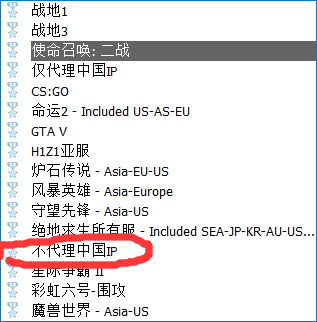

# ssr电脑使用教程\(sstap\)

**我们首先去机场获取代理工具，如下图所示**

**下载好后我们解压文件，然后安装sstap。安装完成后打开sstap，再右击电脑右下角的图标,如下图所示**

**之后我们点击"ssr订阅"，会进入ssr订阅添加界面，如下图所示**

**我们添加完节点后，关掉sstap重新打开，sstap会自己更新订阅，之后我们选择节点**

**之后我们选择代理模式为”不代理中国ip“，如下图**

**最后我们点击连接就可以科学上网了**

——————————————————————————————————————————————————————

**有些小伙伴还是不会怎么办? 没事，我们准备了视频教程，点击"`sstap视频教程`"就可以观看了**

                                                         [**`sstap视频教程`**](https://syjc.ljfxz.com/%E6%95%99%E7%A8%8B%E8%A7%86%E9%A2%91/)**\`\`**

