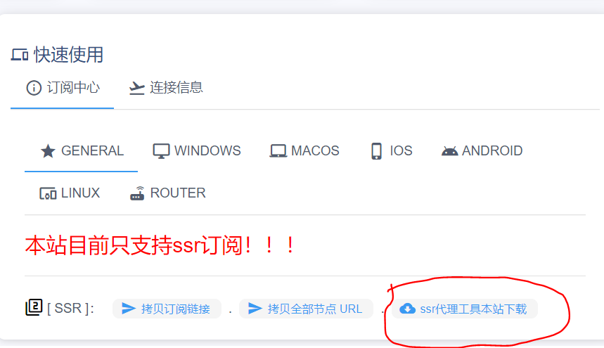

# ssr安卓版教程

**首先我们要下载ssr安卓版代理工具，登入机场并点击如图片所示的地方获取代理工具**

**下载安装好后就可以去机场获取订阅链接，如下图所示**

**之后我们打开手机，进入粉色ssr会看到如下图所示，我们点击左上角**

**之后我们进入第二个界面，接下来我们要添加机场的订阅链接**

**之后点击“+”号，进入如下图所示**

**再点击“添加/升级SSR订阅”，把机场的订阅链接复制进去，进入如下图所示**

**之后会出现下图所示，我们要选择自动更新\(这样我们能第一时间获取机场的新节点\)，再点击确定升级即可**

**接下来我们自己选择一个节点然后进入第一界面，我们往下滑找到“路由”二字并点击,如下图所示**

**这时候我们点击”udp转发“，如下图**

**之后我们选择“绕过局域网和中国大陆地址”，好了之后，我们点击右上角的小飞机图标就可以科学上网了**

