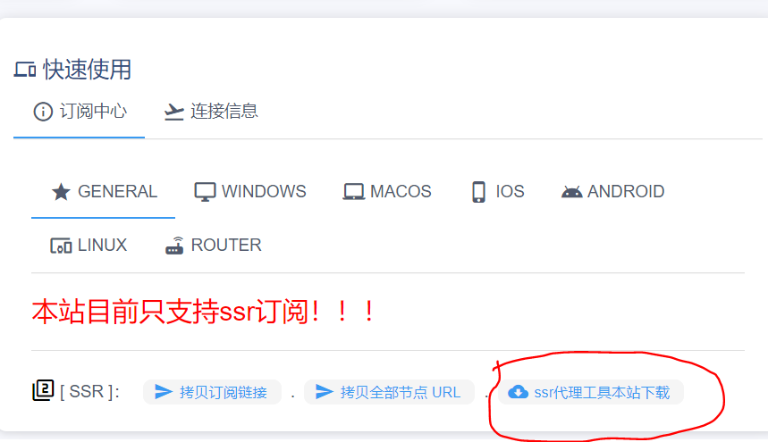
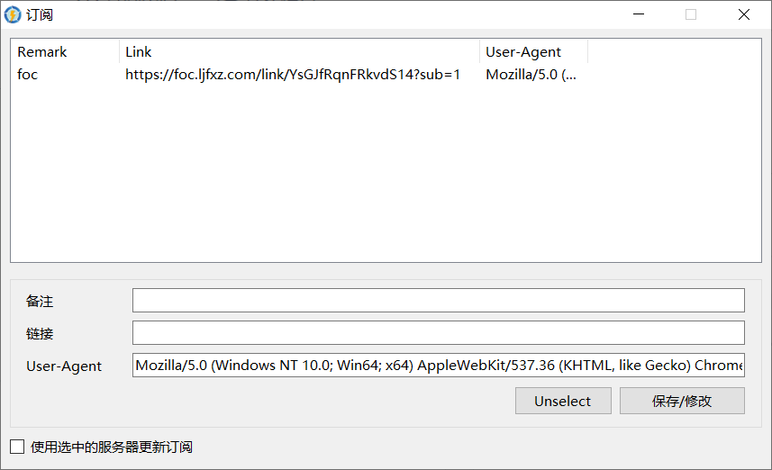
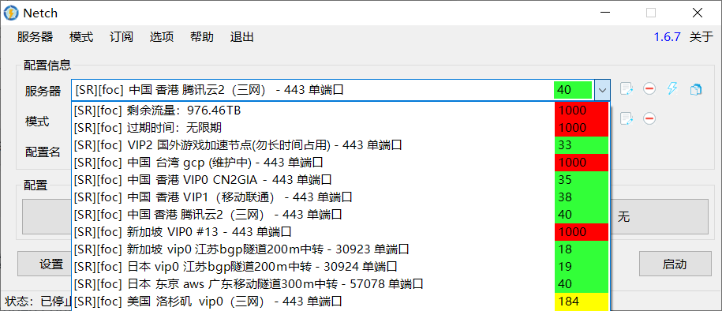
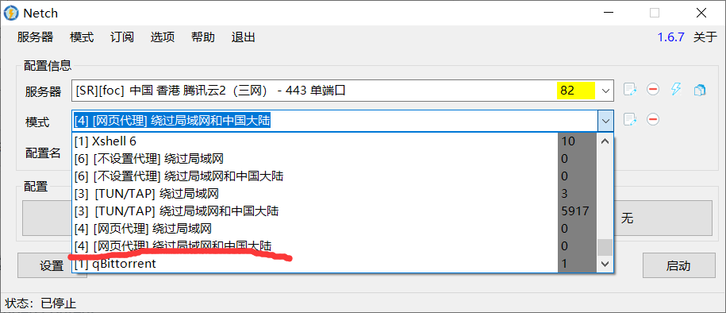

# ssr电脑使用教程\(netch\)

**我们首先登入机场获取代理工具，如下图所示点击**

**下载好后解压文件，并打开netch.exe如下图**

然后我们点击“订阅”二字，如下图

**之后我们进入到添加订阅界面，我们先去机场复制订阅链接，如下图**

**之后把机场复制的订阅链接添加进去并保存修改，如下图所示**

**然后我们点击“订阅”二字，再点击“从订阅链接更新服务器”**

**之后选择节点，模式调成“\[网页代理\] 绕过局域网和中国大陆”，如下图所示**

**最后我们点击启动就能进行科学上网了.**

**---------------------------------------------------------------------------------------------------------------------**

**有些小伙伴还是不会怎么办? 没事，我们准备了视频教程，点击“`netch视频教程"`就能观看了**

                                                                           [**netch视频教程**](https://syjc.ljfxz.com/%E6%95%99%E7%A8%8B%E8%A7%86%E9%A2%91/)\*\*\*\*

